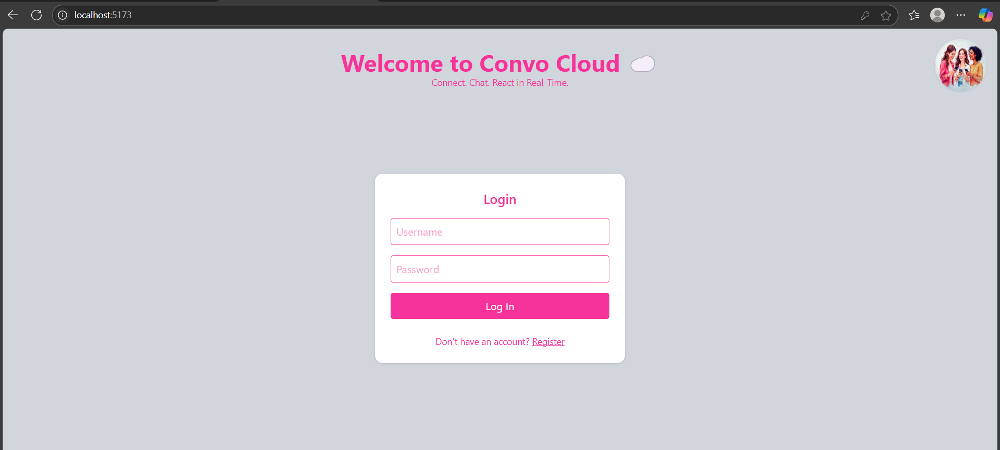
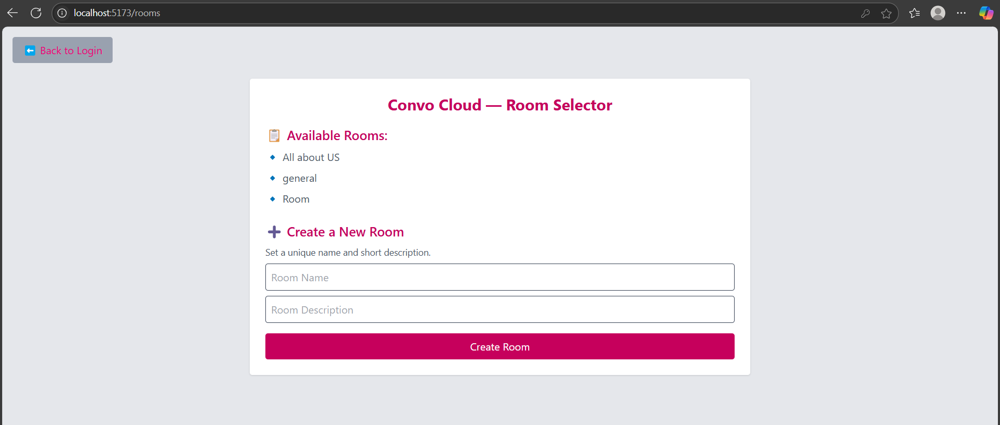
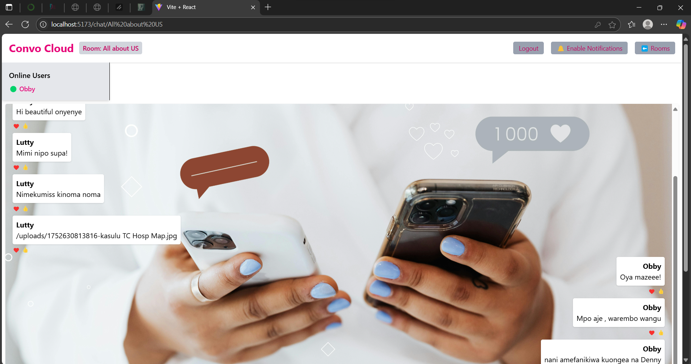

# Convo Cloud - Real-Time Chat Application

Convo Cloud is a real-time chat application built with the MERN stack (MongoDB, Express.js, React, Node.js) and Socket.io. It allows users to join chat rooms, send messages, see online users, receive real-time notifications, share images, and interact with features like typing indicators, read receipts, and message reactions.

---

## 🚀 Project Overview

Convo Cloud enables:

* Joining chat rooms with unique room IDs
* Sending and receiving real-time messages via WebSocket
* User authentication using localStorage (username + userId)
* Private messaging support (via socket IDs)
* Image uploads via an image uploader
* Notification sounds, browser notifications, and unread counters
* Typing indicators, emoji reactions, read receipts

---
## 📁 Project Structure

```
convo-cloud/
├── client/                       # React Frontend
│   ├── assets/
│   │   ├── Logo.jpg
│   │   └── chatArt.jpg
│   ├── src/
│   │   ├── components/
│   │   │   ├── MessageBubble.jsx
│   │   │   ├── ImageUploader.jsx
│   │   │   └── UserSidebar.jsx
│   │   ├── pages/
│   │   │   ├── Chat.jsx
│   │   │   └── Login.jsx
│   │   ├── services/
│   │   │   └── backenInt.js
│   │   ├── utils/
│   │   │   └── ProtectedRoute.jsx
│   │   ├── App.jsx
│   │   └── index.css
│   ├─  vite.config.js
│   └── package.json
├── server/                       # Express Backend + Socket.io
│   ├── config/
│   ├── controllers/  
│   │   ├── authController.js
│   │   ├── messageController.js
│   │   ├── roomController.js
│   │   models/
│   │   ├── User.js
│   │   ├── Message.js
│   │   └── Room.js
│   ├── routes/
│   │   ├── authRoutes.js
│   │   ├── messageRoutes.js
│   │   └── roomRoutes.js
│   ├── socket/
│   │   └── index.js
│   ├── uploads
│   ├── .env
│   └── server.js
├── README.md
└── Screenshots
```

## 🛠️ Setup Instructions

### 1. Clone the Repo

```bash
git clone https://github.com/Lutty112/week-5-web-sockets-assignment-Lutty112.git
cd convo-cloud
```

### 2. Install Backend Dependencies

```bash
cd server
npm install
```

### 3. Set Up Environment Variables in `server/.env`

```
PORT=5000
MONGO_URI=mongodb://localhost:27017/Convo-Cloud

### 4. Start the Backend

```bash
pnpm run dev
```

### 5. Install Frontend Dependencies

```bash
cd client
pnpm install
```

### 6. Start the Frontend (React Vite app)

```bash
pnpm run dev
```

Open `http://localhost:5173` in your browser.

---

## ✅ Features Implemented

* [x] Real-time WebSocket communication
* [x] Join Room + User presence
* [x] Typing indicator & stopTyping
* [x] Image upload support
* [x] Browser + sound notifications
* [x] Unread message counter
* [x] Private messaging
* [x] Read receipts
* [x] Emoji reactions

---

## 🖼️ Screenshots

### Register/Login Page


## Rooms Page


### Chat Page


```

🌍  Deployment
The app is deployed and publicly available at:

🔗 Vercel Live URL: https://week-5-web-sockets-assignment-lutty.vercel.app/

🔗 Render Live URL: https://week-5-web-sockets-assignment-igtt.onrender.com

---

## 🧰 Technologies Used

* React.js + Vite
* Tailwind CSS
* Express.js
* MongoDB & Mongoose
* Socket.io (real-time engine)
* React Toastify (notifications)

---

## 📌 Notes

* Make sure MongoDB is running and reachable.
* Use unique ObjectId for `userId` and `roomId`.
* Notification permissions must be manually enabled if blocked.
* Backend must be running first for frontend Socket.io connection to succeed.

---

Made with ❤️ by Lutfia- {Github-Lutty112} – Enjoy chatting  with Convo Cloud! 💬!
---
